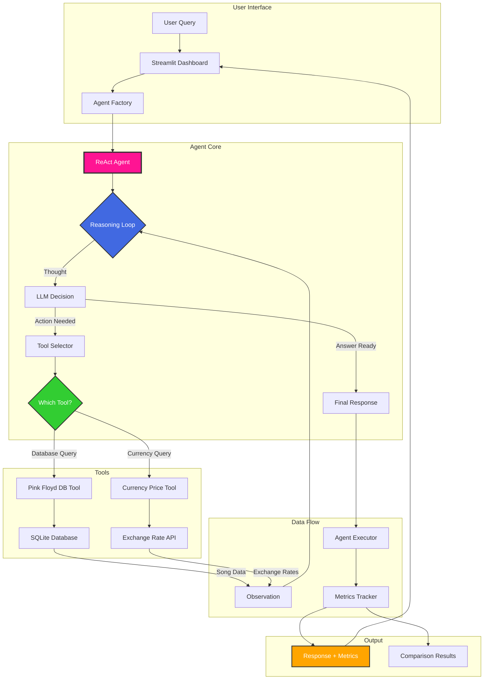
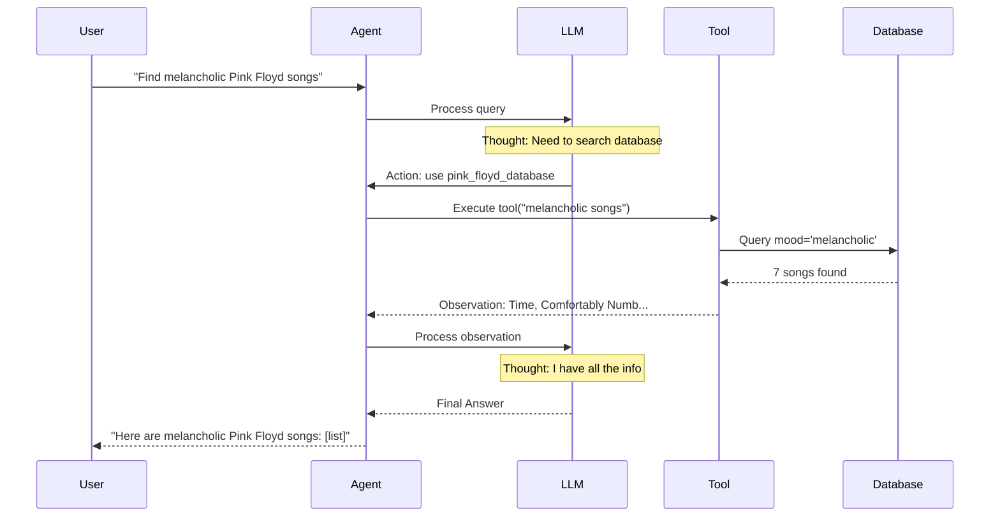

#  Pink Floyd AI Agent Demo

**Orchestration and Autonomous Agents with ReAct Framework**

A modern AI agent system built with FastAPI, Docker, and the ReAct framework. Features REST API endpoints, comprehensive testing, and a Streamlit dashboard for interacting with Pink Floyd songs database and currency tools.

---

##  Quick Start

### Prerequisites

- Python 3.12+ (for local development)
- Docker + Docker Compose (for containerized deployment)
- OpenAI API key
- UV package manager (for local development)

### Option 1: Docker (Recommended)

```bash
# Clone and setup
git clone <repository-url>
cd henry_clase_demo
cp .env.example .env
# Edit .env with your OPENAI_API_KEY

# Build and start services
make docker-build
make docker-up

# Access services:
# - API: http://localhost:8000
# - API Docs: http://localhost:8000/docs
# - Dashboard: http://localhost:8501

# Run tests
make docker-test

# Stop services
make docker-down
```

### Option 2: Local Development

```bash
# Install dependencies and setup database
make init

# Run API server
make run-api

# Run dashboard (in another terminal)
make run-dashboard

# Run tests
make test
```

### Quick Commands

```bash
make help              # Show all available commands
make docker-build      # Build Docker images
make docker-up         # Start all services
make docker-test       # Run tests in Docker
make test              # Run tests locally
make coverage-html     # Generate coverage report
make clean             # Clean generated files
```

---

##  Architecture

### Modern Stack

This project uses a modern microservices architecture with:

- **FastAPI REST API**: High-performance async API with automatic OpenAPI documentation
- **Docker + Docker Compose**: Containerized services for consistent deployments
- **Comprehensive Testing**: Unit, integration, and E2E tests with >80% coverage
- **Colored Logging**: Beautiful console output with loguru (green/red for success/errors)
- **Makefile Automation**: One-command operations for all workflows
- **Streamlit Dashboard**: Interactive UI that consumes the REST API

### Services

1. **API Service** (`api/`)
   - FastAPI application with 5 routers (health, agent, database, comparison, metrics)
   - Request logging middleware with colored output
   - Pydantic schemas for validation
   - Service layer for business logic

2. **Dashboard Service** (`dashboard/`)
   - Streamlit web interface
   - Calls API via httpx
   - Real-time agent interaction

3. **Tests Service** (`tests/`)
   - 21+ unit tests for src/ modules
   - 18+ integration tests for API endpoints
   - 3 E2E tests for complete workflows
   - >80% code coverage requirement

### API Endpoints

- `GET /health` - Health checks
- `POST /api/v1/agent/query` - Execute agent queries
- `GET /api/v1/agent/models` - List available models
- `GET /api/v1/database/songs` - Search Pink Floyd songs
- `POST /api/v1/comparison/run` - Compare model performance

See [API Documentation](docs/API.md) for complete API reference.

---

##  System Architecture (Original)



### Architecture Components

#### 1. **User Interface Layer**
- **Streamlit Dashboard**: Interactive web interface
- **Jupyter Notebooks**: Educational demonstrations
- **Query Input**: Natural language queries from users

#### 2. **Agent Core**
- **Agent Factory**: Creates agents with different models (gpt-4o-mini, gpt-4o, gpt-5-nano)
- **ReAct Agent**: Implements Reasoning + Acting framework
- **Reasoning Loop**: Iterative thought → action → observation cycle
- **LLM Decision**: OpenAI model makes decisions on tool usage

#### 3. **Tools Layer**
- **Pink Floyd Database Tool**:
  - Queries 28 curated Pink Floyd songs
  - Search by mood, album, lyrics, year
  - SQLite backend with indexed search

- **Currency Price Tool**:
  - Real-time exchange rates (USD, EUR, GBP, JPY, etc.)
  - API integration with caching (5-min TTL)
  - Fallback to mock data for reliability

#### 4. **Data & Metrics**
- **Agent Executor**: Tracks performance metrics
- **Metrics Tracker**: Response time, tokens, cost
- **Comparison Results**: Multi-model performance analysis

---

##  ReAct Framework Explained

The **ReAct** framework combines **Reasoning** and **Acting** to create transparent, autonomous agents:



### ReAct Steps

1. ** Thought**: Agent reasons about the task
   ```
   "User wants melancholic Pink Floyd songs.
    I should query the database with mood='melancholic'"
   ```

2. ** Action**: Agent uses a tool
   ```
   Tool: pink_floyd_database
   Input: {"query": "melancholic songs"}
   ```

3. ** Observation**: Agent receives tool output
   ```
   Found 7 songs: Time, Comfortably Numb, Wish You Were Here...
   ```

4. ** Repeat or Answer**: Continue or provide final response

---

##  Tools Design

### Pink Floyd Database Tool

```python
class PinkFloydDatabaseTool(BaseTool):
    name = "pink_floyd_database"
    description = """
    Query Pink Floyd songs by:
    - Mood (melancholic, energetic, psychedelic, progressive, dark)
    - Album (The Dark Side of the Moon, The Wall, etc.)
    - Lyrics keywords
    - Year or decade
    """

    def _run(self, query: str) -> str:
        # Parse natural language query
        # Execute database search
        # Return formatted results
```

**Database Schema:**
- 28 iconic Pink Floyd songs
- Fields: title, album, year, lyrics, mood, duration
- Indexed search on mood, album, year

### Currency Price Tool

```python
class CurrencyPriceTool(BaseTool):
    name = "currency_price_checker"
    description = """
    Get real-time currency exchange rates.
    Supports: USD, EUR, GBP, JPY, CHF, CAD, AUD, MXN, BRL, CNY
    """

    def _run(self, query: str) -> str:
        # Parse currency pair
        # Check cache (5-min TTL)
        # Fetch from API or use mock data
        # Return exchange rate
```

**Features:**
- Real-time API integration (exchangerate-api.io)
- 5-minute caching for performance
- Fallback to mock data for demo reliability
- Supports 10+ major currencies

---

##  Model Comparison

Compare performance across three OpenAI models:

| Model | Speed | Cost | Accuracy |
|-------|-------|------|----------|
| **gpt-4o-mini** |  Fast |  Cheapest |  Good |
| **gpt-4o** |  Moderate |  Expensive |  Excellent |
| **gpt-5-nano** |  Very Fast |  Very Cheap |  Good |

### Running Comparison

```bash
# Run full comparison (all 8 test queries)
uv run python scripts/run_comparison.py

# Compare specific models
uv run python scripts/run_comparison.py --models gpt-4o-mini,gpt-4o

# Save to custom path
uv run python scripts/run_comparison.py --output results/my_comparison.json
```

### Metrics Tracked

- **Response Time**: Seconds to complete query
- **Token Usage**: Input + output tokens
- **Cost Estimation**: Based on OpenAI pricing
- **Success Rate**: % of queries answered correctly
- **Reasoning Steps**: Number of tool calls

---

##  Project Structure

```
henry_clase_demo/
├── api/                        # FastAPI REST API
│   ├── main.py                 # FastAPI app entry point
│   ├── middleware.py           # Request logging middleware
│   ├── core/                   # Core utilities
│   │   ├── logger.py           # Loguru colored logging
│   │   ├── errors.py           # Custom exceptions
│   │   └── config.py           # API configuration
│   ├── routers/                # API endpoints
│   │   ├── health.py           # Health checks
│   │   ├── agent.py            # Agent endpoints
│   │   ├── database.py         # Database endpoints
│   │   ├── comparison.py       # Comparison endpoints
│   │   └── metrics.py          # Metrics endpoints
│   ├── schemas/                # Pydantic models
│   │   ├── common.py           # Common schemas
│   │   ├── agent.py            # Agent schemas
│   │   ├── database.py         # Database schemas
│   │   └── comparison.py       # Comparison schemas
│   └── services/               # Business logic
│       ├── agent_service.py    # Agent service
│       ├── database_service.py # Database service
│       └── comparison_service.py # Comparison service
│
├── src/                        # Core logic (unchanged)
│   ├── config.py               # Configuration with Pydantic
│   ├── database/               # Pink Floyd songs database
│   ├── tools/                  # Custom agent tools
│   ├── agents/                 # ReAct agent implementation
│   └── comparison/             # Model comparison framework
│
├── dashboard/                  # Streamlit dashboard (adapted for API)
│   ├── app.py                  # Main dashboard
│   └── pages/
│       ├── 1_Live_Agent.py     # Interactive agent (uses API)
│       ├── 2_Model_Comparison.py # Comparison dashboard
│       └── 3_Architecture.py   # Architecture explanation
│
├── tests/                      # Comprehensive test suite
│   ├── conftest.py             # Global fixtures
│   ├── unit/                   # Unit tests (60% coverage)
│   ├── integration/            # Integration tests (25% coverage)
│   └── e2e/                    # E2E tests (15% coverage)
│
├── docker/                     # Docker configuration
│   ├── Dockerfile.api          # API production image
│   ├── Dockerfile.tests        # Test runner image
│   └── Dockerfile.dashboard    # Dashboard image
│
├── docs/                       # Documentation
│   ├── API.md                  # API reference
│   └── DEPLOYMENT.md           # Deployment guide
│
├── docker-compose.yml          # Service orchestration
├── docker-compose.dev.yml      # Development mode
├── docker-compose.test.yml     # Test mode
├── Makefile                    # Automation commands
├── .env.example                # Environment template
├── pyproject.toml              # Dependencies & config
└── README.md                   # This file
```

---

##  Use Cases & Example Queries

### Database Queries

```python
# Simple mood query
"Find melancholic Pink Floyd songs"
→ Returns: Time, Comfortably Numb, Wish You Were Here...

# Album query
"Show me songs from The Dark Side of the Moon"
→ Returns: Time, Money, Us and Them, Brain Damage, Eclipse

# Complex query
"What psychedelic songs are from the 1960s?"
→ Returns: Astronomy Domine, Interstellar Overdrive

# Lyrics search
"Songs with lyrics about time"
→ Returns: Time, Us and Them
```

### Currency Queries

```python
# Simple exchange rate
"What's the USD to EUR exchange rate?"
→ Returns: 1 USD = 0.85 EUR

# Conversion
"How much is 100 dollars in British pounds?"
→ Returns: 100 USD = 79 GBP

# Multiple currencies
"Compare USD to JPY"
→ Returns: 1 USD = 149.50 JPY
```

### Combined Queries

```python
# Multi-tool usage
"I want energetic Pink Floyd music and the EUR price"
→ Uses both tools:
   1. Database: Money, Run Like Hell, Sheep...
   2. Currency: 1 USD = 0.85 EUR
```

---

##  Key Technologies

- **Python 3.12**: Modern Python features
- **OpenAI API**: GPT models (gpt-4o-mini, gpt-4o, gpt-5-nano)
- **LangChain**: Framework for LLM applications
- **Streamlit**: Interactive web dashboard
- **SQLAlchemy**: Database ORM
- **Pydantic**: Data validation
- **Plotly**: Interactive visualizations
- **UV**: Fast Python package manager
- **Pytest**: Testing framework

---

##  References

- **ReAct Paper**: [Yao et al., 2022 - ReAct: Synergizing Reasoning and Acting in Language Models](https://arxiv.org/abs/2210.03629)
- **LangChain Documentation**: [python.langchain.com](https://python.langchain.com)
- **OpenAI API**: [platform.openai.com](https://platform.openai.com)
- **Streamlit**: [streamlit.io](https://streamlit.io)

---

##  About

**Pink Floyd Edition** - A tribute to one of the greatest progressive rock bands of all time, demonstrating how AI agents can interact with structured knowledge (their music catalog) while also accessing real-time information (currency exchange rates).

Built with  for the Henry Class Demo on **Orchestration and Autonomous Agents**.

**Happy Coding! **
