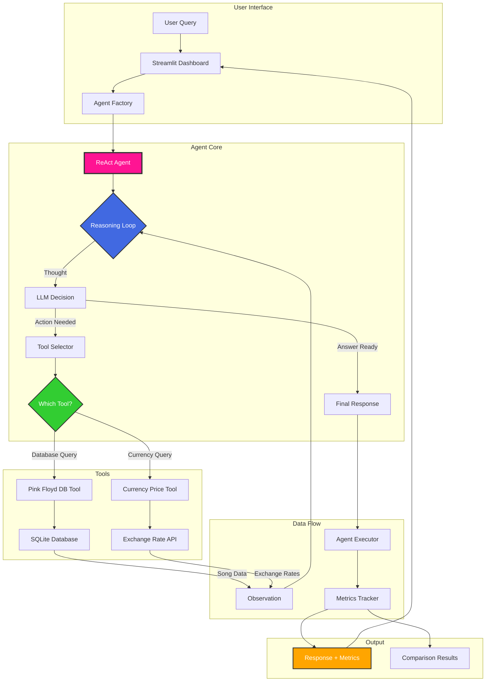
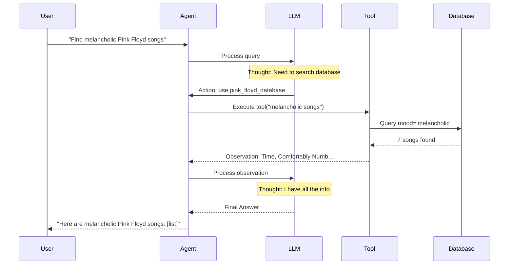

#  Pink Floyd AI Agent Demo

**Orchestration and Autonomous Agents with ReAct Framework**

A comprehensive demonstration of building AI agents using the ReAct (Reasoning + Acting) framework with LangChain and OpenAI. Features custom tools for querying Pink Floyd songs and real-time currency prices.

---

##  Quick Start

### Prerequisites

- Python 3.12+
- OpenAI API key
- UV package manager

### Installation

```bash
# Clone the repository
cd henry_clase_demo

# Install UV (if not already installed)
curl -LsSf https://astral.sh/uv/install.sh | sh

# Install dependencies
uv sync --group dev

# Set up environment variables
# .env file already exists with OPENAI_API_KEY

# Initialize database
uv run python scripts/setup_database.py
```

### Running the Demo

```bash
# Launch Streamlit Dashboard
uv run streamlit run dashboard/app.py

# Run Model Comparison
uv run python scripts/run_comparison.py

# Launch Jupyter Notebooks
uv run jupyter notebook
```

---

##  System Architecture



### Architecture Components

#### 1. **User Interface Layer**
- **Streamlit Dashboard**: Interactive web interface
- **Jupyter Notebooks**: Educational demonstrations
- **Query Input**: Natural language queries from users

#### 2. **Agent Core**
- **Agent Factory**: Creates agents with different models (gpt-4o-mini, gpt-4o, gpt-5-nano)
- **ReAct Agent**: Implements Reasoning + Acting framework
- **Reasoning Loop**: Iterative thought → action → observation cycle
- **LLM Decision**: OpenAI model makes decisions on tool usage

#### 3. **Tools Layer**
- **Pink Floyd Database Tool**:
  - Queries 28 curated Pink Floyd songs
  - Search by mood, album, lyrics, year
  - SQLite backend with indexed search

- **Currency Price Tool**:
  - Real-time exchange rates (USD, EUR, GBP, JPY, etc.)
  - API integration with caching (5-min TTL)
  - Fallback to mock data for reliability

#### 4. **Data & Metrics**
- **Agent Executor**: Tracks performance metrics
- **Metrics Tracker**: Response time, tokens, cost
- **Comparison Results**: Multi-model performance analysis

---

##  ReAct Framework Explained

The **ReAct** framework combines **Reasoning** and **Acting** to create transparent, autonomous agents:



### ReAct Steps

1. ** Thought**: Agent reasons about the task
   ```
   "User wants melancholic Pink Floyd songs.
    I should query the database with mood='melancholic'"
   ```

2. ** Action**: Agent uses a tool
   ```
   Tool: pink_floyd_database
   Input: {"query": "melancholic songs"}
   ```

3. ** Observation**: Agent receives tool output
   ```
   Found 7 songs: Time, Comfortably Numb, Wish You Were Here...
   ```

4. ** Repeat or Answer**: Continue or provide final response

---

##  Tools Design

### Pink Floyd Database Tool

```python
class PinkFloydDatabaseTool(BaseTool):
    name = "pink_floyd_database"
    description = """
    Query Pink Floyd songs by:
    - Mood (melancholic, energetic, psychedelic, progressive, dark)
    - Album (The Dark Side of the Moon, The Wall, etc.)
    - Lyrics keywords
    - Year or decade
    """

    def _run(self, query: str) -> str:
        # Parse natural language query
        # Execute database search
        # Return formatted results
```

**Database Schema:**
- 28 iconic Pink Floyd songs
- Fields: title, album, year, lyrics, mood, duration
- Indexed search on mood, album, year

### Currency Price Tool

```python
class CurrencyPriceTool(BaseTool):
    name = "currency_price_checker"
    description = """
    Get real-time currency exchange rates.
    Supports: USD, EUR, GBP, JPY, CHF, CAD, AUD, MXN, BRL, CNY
    """

    def _run(self, query: str) -> str:
        # Parse currency pair
        # Check cache (5-min TTL)
        # Fetch from API or use mock data
        # Return exchange rate
```

**Features:**
- Real-time API integration (exchangerate-api.io)
- 5-minute caching for performance
- Fallback to mock data for demo reliability
- Supports 10+ major currencies

---

##  Model Comparison

Compare performance across three OpenAI models:

| Model | Speed | Cost | Accuracy |
|-------|-------|------|----------|
| **gpt-4o-mini** |  Fast |  Cheapest |  Good |
| **gpt-4o** |  Moderate |  Expensive |  Excellent |
| **gpt-5-nano** |  Very Fast |  Very Cheap |  Good |

### Running Comparison

```bash
# Run full comparison (all 8 test queries)
uv run python scripts/run_comparison.py

# Compare specific models
uv run python scripts/run_comparison.py --models gpt-4o-mini,gpt-4o

# Save to custom path
uv run python scripts/run_comparison.py --output results/my_comparison.json
```

### Metrics Tracked

- **Response Time**: Seconds to complete query
- **Token Usage**: Input + output tokens
- **Cost Estimation**: Based on OpenAI pricing
- **Success Rate**: % of queries answered correctly
- **Reasoning Steps**: Number of tool calls

---

##  Project Structure

```
henry_clase_demo/
 src/                        # Source code
    config.py              # Configuration with Pydantic
    database/              # Pink Floyd songs database
       schema.py          # SQLAlchemy models
       seed_data.py       # 28 curated songs
       db_manager.py      # Database operations
    tools/                 # Custom agent tools
       database_tool.py   # Pink Floyd database tool
       currency_tool.py   # Currency price tool
    agents/                # ReAct agent implementation
       react_agent.py     # Core ReAct logic
       agent_factory.py   # Multi-model agent factory
       agent_executor.py  # Execution & metrics
    comparison/            # Model comparison framework
        metrics.py         # Performance metrics
        evaluator.py       # Comparison logic
        test_cases.py      # Standard test queries

 dashboard/                 # Streamlit dashboard
    app.py                # Main dashboard
    pages/
        1_Live_Agent.py   # Interactive agent demo
        2_Model_Comparison.py  # Comparison dashboard
        3_Architecture.py # Architecture explanation

 scripts/                   # Utility scripts
    setup_database.py     # Initialize database
    run_comparison.py     # Run model comparison

 data/                      # Generated data
    pink_floyd_songs.db   # SQLite database
    comparison_results.json  # Comparison results

 .env                       # Environment variables (OPENAI_API_KEY)
 pyproject.toml            # Project metadata & dependencies
 README.md                 # This file
```

---

##  Use Cases & Example Queries

### Database Queries

```python
# Simple mood query
"Find melancholic Pink Floyd songs"
→ Returns: Time, Comfortably Numb, Wish You Were Here...

# Album query
"Show me songs from The Dark Side of the Moon"
→ Returns: Time, Money, Us and Them, Brain Damage, Eclipse

# Complex query
"What psychedelic songs are from the 1960s?"
→ Returns: Astronomy Domine, Interstellar Overdrive

# Lyrics search
"Songs with lyrics about time"
→ Returns: Time, Us and Them
```

### Currency Queries

```python
# Simple exchange rate
"What's the USD to EUR exchange rate?"
→ Returns: 1 USD = 0.85 EUR

# Conversion
"How much is 100 dollars in British pounds?"
→ Returns: 100 USD = 79 GBP

# Multiple currencies
"Compare USD to JPY"
→ Returns: 1 USD = 149.50 JPY
```

### Combined Queries

```python
# Multi-tool usage
"I want energetic Pink Floyd music and the EUR price"
→ Uses both tools:
   1. Database: Money, Run Like Hell, Sheep...
   2. Currency: 1 USD = 0.85 EUR
```

---

##  Key Technologies

- **Python 3.12**: Modern Python features
- **OpenAI API**: GPT models (gpt-4o-mini, gpt-4o, gpt-5-nano)
- **LangChain**: Framework for LLM applications
- **Streamlit**: Interactive web dashboard
- **SQLAlchemy**: Database ORM
- **Pydantic**: Data validation
- **Plotly**: Interactive visualizations
- **UV**: Fast Python package manager
- **Pytest**: Testing framework

---

##  References

- **ReAct Paper**: [Yao et al., 2022 - ReAct: Synergizing Reasoning and Acting in Language Models](https://arxiv.org/abs/2210.03629)
- **LangChain Documentation**: [python.langchain.com](https://python.langchain.com)
- **OpenAI API**: [platform.openai.com](https://platform.openai.com)
- **Streamlit**: [streamlit.io](https://streamlit.io)

---

##  About

**Pink Floyd Edition** - A tribute to one of the greatest progressive rock bands of all time, demonstrating how AI agents can interact with structured knowledge (their music catalog) while also accessing real-time information (currency exchange rates).

Built with  for the Henry Class Demo on **Orchestration and Autonomous Agents**.

**Happy Coding! **
